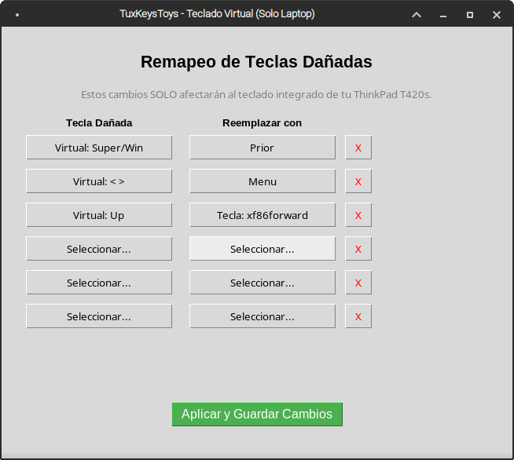
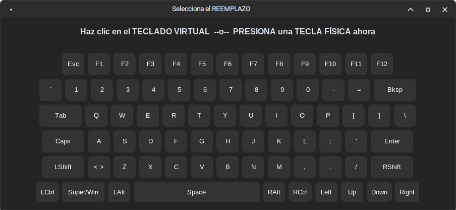

# TuxKeysToys 🐧⌨️

<div align="center">
  
  
  
  
  <br><br>
  
  
</div>

**TuxKeysToys** es una utilidad gráfica para Linux diseñada para facilitar el remapeo de teclas a nivel de hardware. Su principal ventaja es que **afecta exclusivamente al teclado integrado de la laptop**, respetando el comportamiento original de teclados externos (USB, Bluetooth, etc.).

Esta herramienta es ideal para recuperar la funcionalidad de laptops con teclas físicas dañadas, actuando de forma similar a utilidades como *PowerToys* en Windows, pero construida específicamente sobre las entrañas de Linux.

---

## 📑 Tabla de Contenidos
- [Características](#características-)
- [Arquitectura (MVC)](#arquitectura-mvc-)
- [Compatibilidad](#compatibilidad-)
- [Requisitos Previos](#requisitos-previos-)
- [Instalación](#instalación-del-proyecto-)
- [Uso](#uso-)
- [Contribuciones y Desarrollo](#contribuciones-)

---

## Características ✨

- **Remapeo Exclusivo y Seguro:** Modifica eventos del identificador de hardware del teclado integrado (`0001:0001`), evitando que tus periféricos externos se remapeen accidentalmente.
- **Teclado Virtual Interactivo:** Interfaz para seleccionar combinaciones y teclas que ya no puedes presionar físicamente.
- **Backend a nivel Kernel:** Desarrollado sobre `keyd`, un demonio ultra-ligero que intercepta llamadas a muy bajo nivel, garantizando que el remapeo funcione incluso desde la pantalla de inicio de sesión (Display Manager) o terminales (TTY).
- **Persistente:** La configuración sobrevive a reinicios.

## Arquitectura (MVC) 🏗️

Para garantizar un código mantenible y altamente testeable, TuxKeysToys sigue principios de Arquitectura Limpia (MVC):

- **Core (`src/tuxkeystoys/core/`):** Contiene las reglas puras del negocio y lógica de validación de mapeos (`RemapService`).
- **Infraestructura (`src/tuxkeystoys/infrastructure/`):** Gestiona los efectos secundarios, como la lectura/escritura de los archivos de configuración en `/etc/keyd/` y la invocación de subprocesos con permisos elevados (`SystemHandler`).
- **UI (`src/tuxkeystoys/ui/`):** Vistas completamente desacopladas de la lógica, construidas con `customtkinter` para asegurar un aspecto moderno (`AppWindow`, `VirtualKeyboardDialog`).

## Compatibilidad 💻

Probado exitosamente en una **ThinkPad T420s**, interceptando automáticamente los teclados internos y botones ACPI. Debería funcionar *Out-of-the-Box* en la inmensa mayoría de laptops del mercado (Asus, Dell, HP, Acer, etc.).

## Requisitos Previos 🛠️

- **Python 3.8+** y soporte para Tkinter (`python3-tk`).
- **Dependencias base de Python:** `python3-venv` y `build-essential`.
- **`keyd`** instalado y corriendo como servicio en el sistema.

### Instalación de `keyd` (Ubuntu / Debian / MX Linux)

```bash
sudo apt update && sudo apt install -y build-essential git python3-tk python3-venv
git clone https://github.com/rvaiya/keyd /tmp/keyd
cd /tmp/keyd
make && sudo make install
sudo systemctl enable keyd
sudo systemctl start keyd
```

## Instalación del Proyecto 🚀

```bash
# 1. Clonar el repositorio
git clone https://github.com/carlosindriago/tuxkeystoys.git
cd tuxkeystoys

# 2. Crear entorno virtual (con acceso a librerías del sistema para Tkinter)
python3 -m venv venv --system-site-packages

# 3. Instalar TuxKeysToys
./venv/bin/pip install -e .
```

## Uso 🎮

1. Lanza la aplicación ejecutando:
   ```bash
   sudo -E ./venv/bin/tuxkeystoys
   ```
2. Haz clic en "Seleccionar..." debajo de **Tecla Dañada**.
3. Si la tecla está rota físicamente, selecciónala en el **Teclado Virtual**.
4. Haz clic en "Seleccionar..." debajo de **Reemplazar con**.
5. Presiona físicamente la tecla que actuará como reemplazo.
6. Haz clic en **💾 Aplicar Cambios**.
7. ¡Disfruta de tu teclado!

## Contribuciones 🤝

¡Las contribuciones son bienvenidas! Revisa nuestro documento [CONTRIBUTING.md](CONTRIBUTING.md) para ver las directrices de desarrollo, cómo correr las pruebas unitarias y cómo enviar Pull Requests.

También te pedimos que leas nuestro [Código de Conducta](CODE_OF_CONDUCT.md).

## Licencia 📄

Este proyecto está bajo la Licencia MIT. Consulta el archivo `LICENSE` para más detalles.

---
*Desarrollado con ❤️ en MX Linux por Carlos Indriago.*
